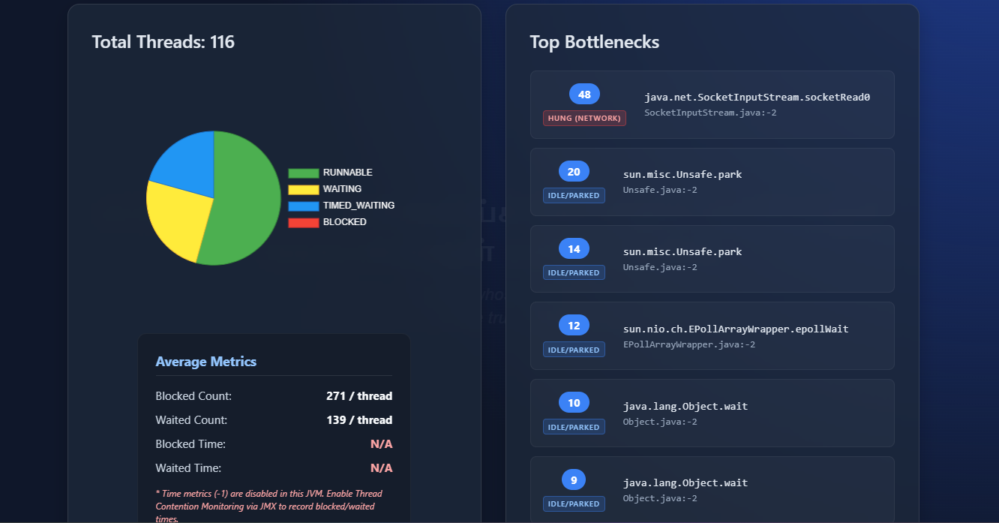
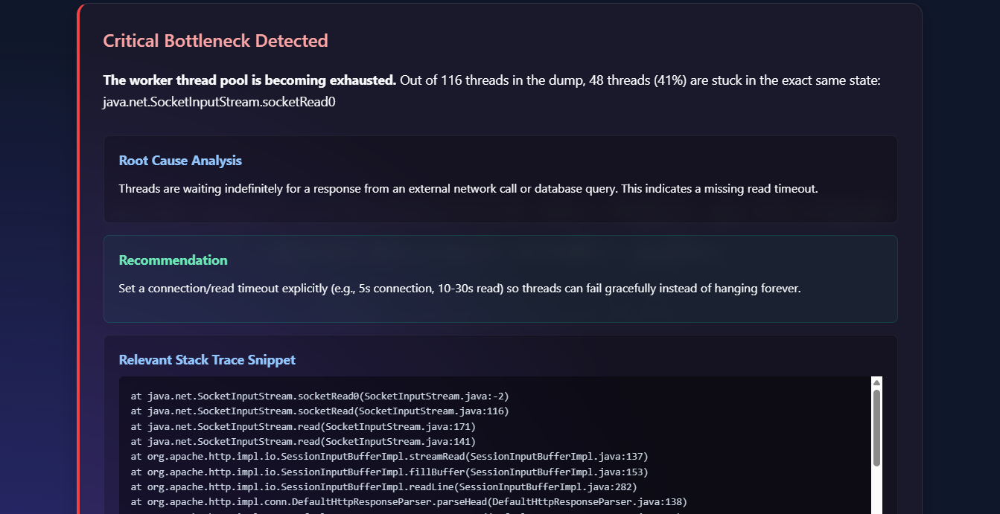

# Thread Dump Visualizer 🦖

A powerful, blazingly fast desktop application to parse, visualize, and analyze JVM Thread Dumps (JBoss CLI, jstack, etc.).




## Features

- **Automated Insights**: Instantly detects JVM bottlenecks, thread starvation, connection pool exhaustion, and network hangs.
- **Smart Analytics**: Generates a beautiful pie chart of thread states (RUNNABLE, WAITING, BLOCKED).
- **Average Metrics**: Computes average blocked counts, waited counts, and contention times across the thread pool.
- **Top Bottlenecks**: Identifies the exact class, method, and line numbers causing the most blockage, tagged with color-coded severity badges.
- **Offline & Secure**: Built with Tauri and React. Runs 100% locally on your machine with no data sent to any server.

## Installation

Download the latest installer for Windows, macOS, or Ubuntu from the Releases page.

## Development

```bash
# Install dependencies
npm install

# Run in development mode
npm run tauri dev

# Build for production
npm run tauri build
```
# Actions CI/CD Pipeline.

Workflow file at 
```bash
release.yml
```

## How to trigger it:

Make sure this project is pushed to a GitHub repository.
Commit all your changes:

```bash
git add .
git commit -m "Release v1.0.0"
```

Tag your release with a version number (this is what triggers the automated builders!):

```bash
git tag "v1.0.0"
git push origin main
git push origin "v1.0.0"
```

Once you run git push origin "v1.0.0", GitHub's automated servers will immediately spin up a Mac, an Ubuntu, and a Windows machine in the cloud. They will build the app and automatically create a Release on your GitHub page containing the `.dmg`, `.deb`, `.AppImage`, and `.msi` installers!